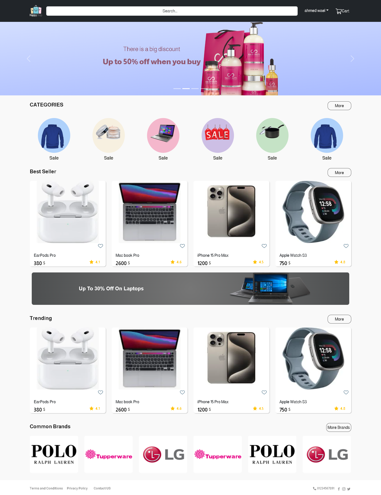
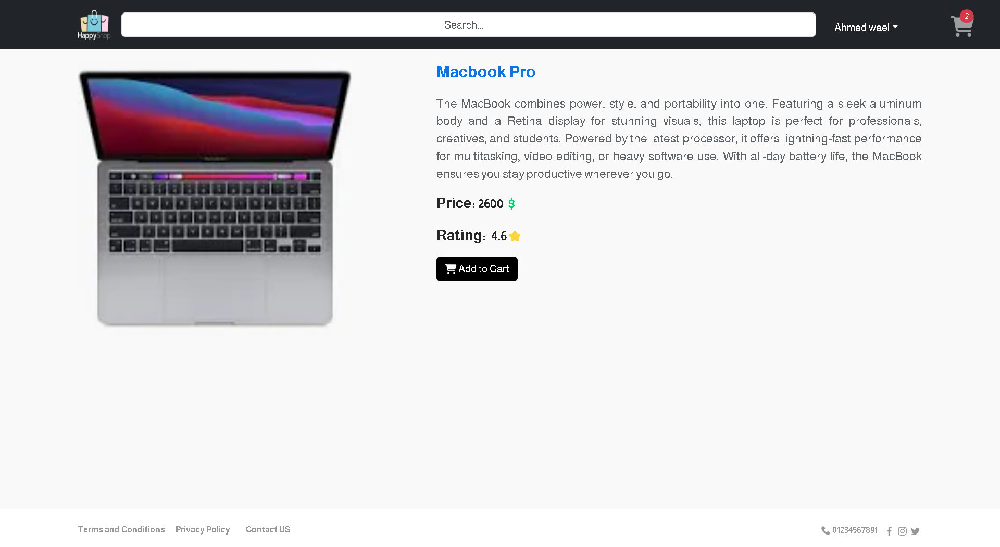
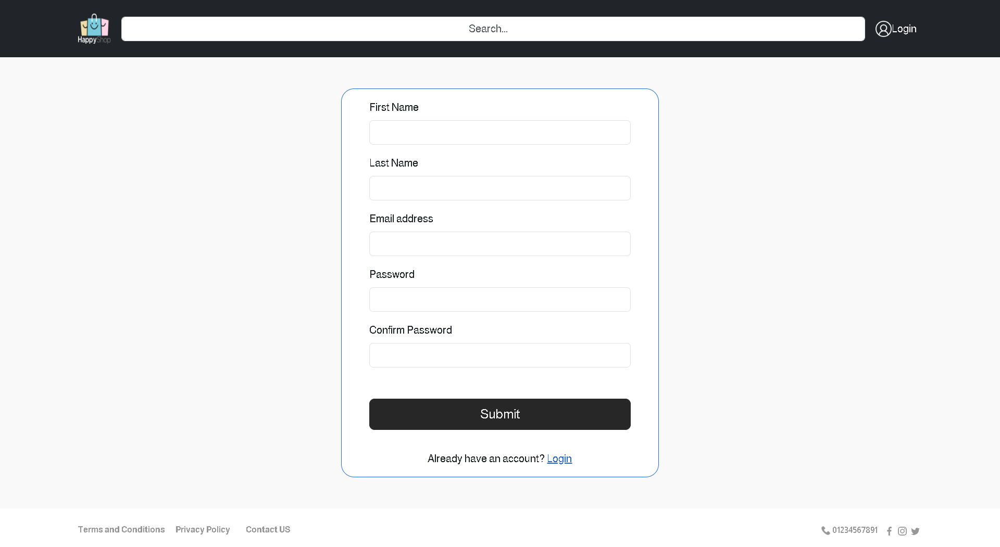
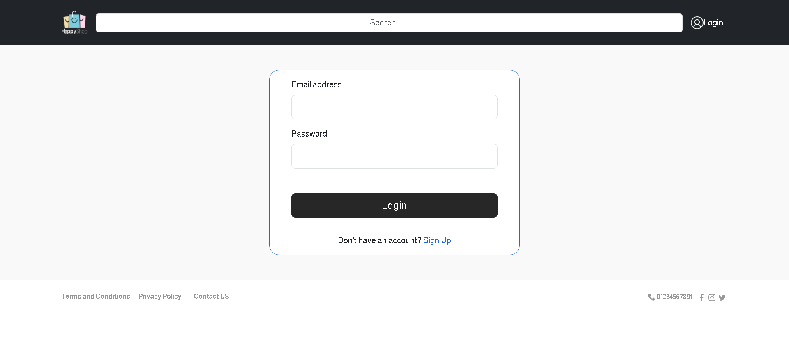
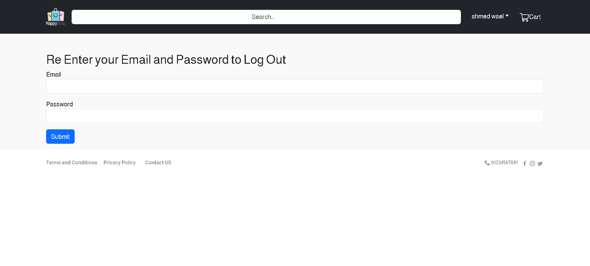
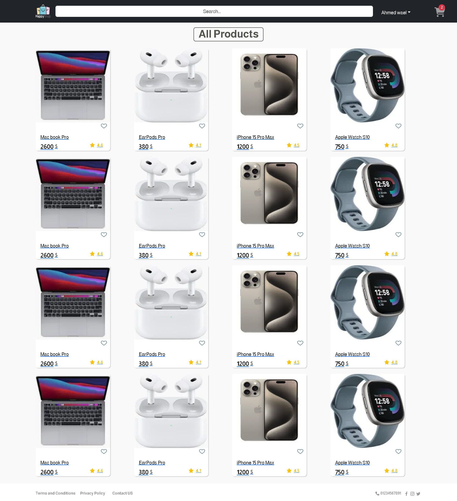
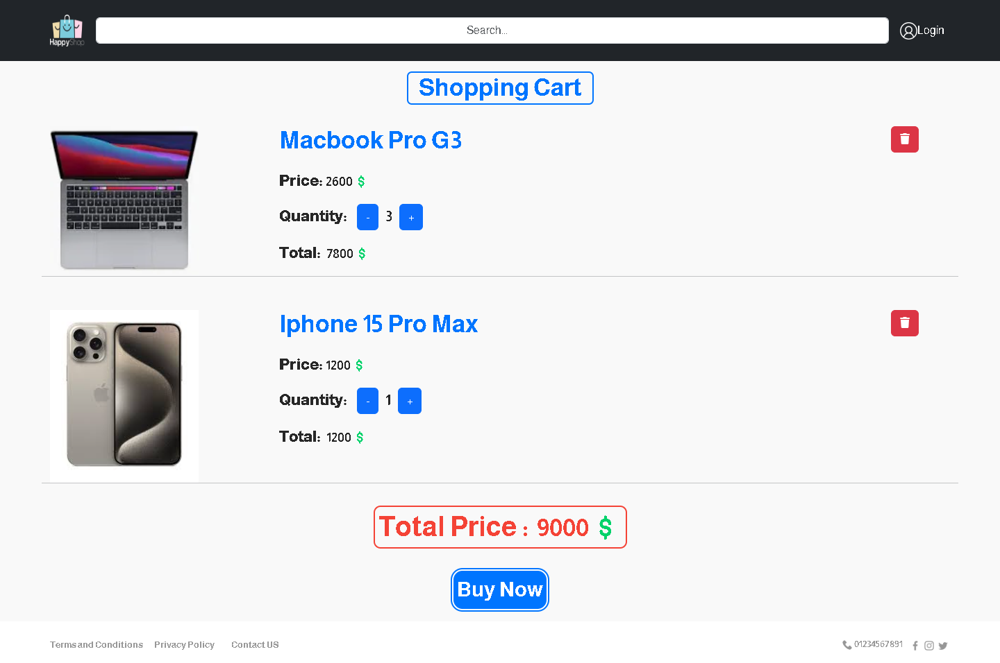

# E-Commerce Website (ITI Final Project)

## About the Project
This e-commerce platform is a comprehensive online marketplace that offers users a smooth shopping experience. The website features user logins, a product catalogue, a virtual shopping cart, and an administrative dashboard for managing the store. The project was developed with growth and speed in mind, ensuring a quick and responsive user interface on all devices.

## Technologies
The following technologies were used in the development of this project:
<ul>
  <li><strong>Frontend :</strong> HTML5, CSS3, JavaScript, React Bootstrap, React.js, Redux</li>
  <li><strong>Authentication:</strong> JSON Web Tokens (JWT)</li>
  <li><strong>Version Control:</strong>  Git, GitHub </li>
</ul>

## Features
<ul>
  <li><strong>User Authentication:</strong> Secure login and registration system.</li>
  <li><strong>Product Browsing:</strong> Browse products by categories with detailed product pages.</li>
  <li><strong>Shopping Cart:</strong> Add items to the cart, manage quantities, and proceed to checkout.</li>
  <li><strong>Admin Panel: </strong> Manage users and their feedback with an intuitive interface.</li>
  <li><strong>Responsive Design:</strong> Responsive Design: Fully responsive, ensuring optimal user experience on all devices.</li>
  <li><strong>Registration System:</strong> Includes registration, secure login, password updates, and password reset functionality.</li>
</ul>

## Setup
follow the following steps to run the project:
<ul>
  <li>Install Node.js from [Node.js](https://nodejs.org/en) </li>
  <li>Clone this repo on your local machine.</li>
  <li>Run these commands on the project directory respectively:
  <ul>
    <li>npm install</li>
    <li>npm run json-server</li>
    <li>npm install</li>
  </ul>
  </li>
</ul>

## ScreenShots From the project:
<picture>
  
</picture>
<picture>
  
</picture>
<picture>
  
</picture>
<picture>
  
</picture>
<picture>
  
</picture>
<picture>
  
</picture>
<picture>
  
</picture>
